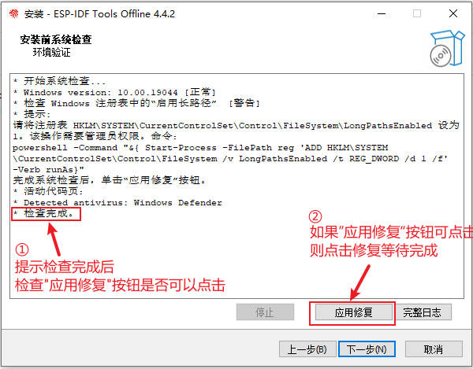
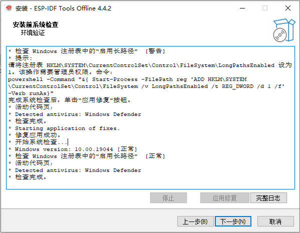
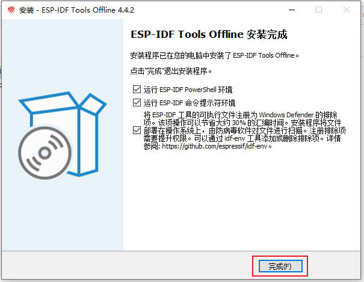
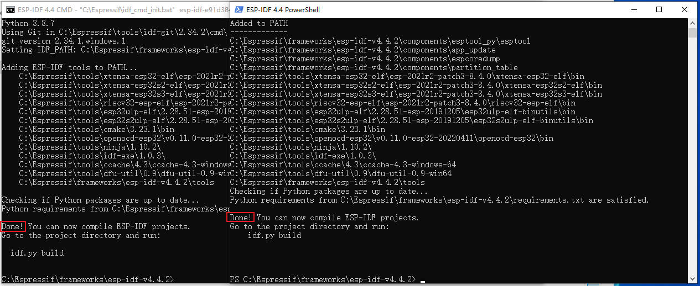
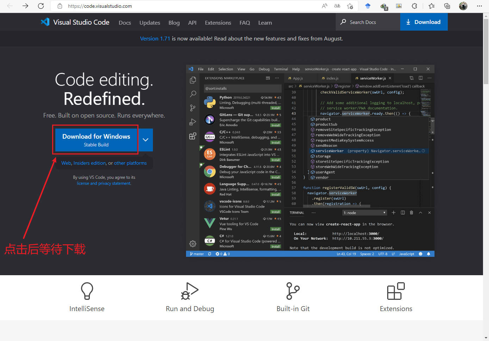
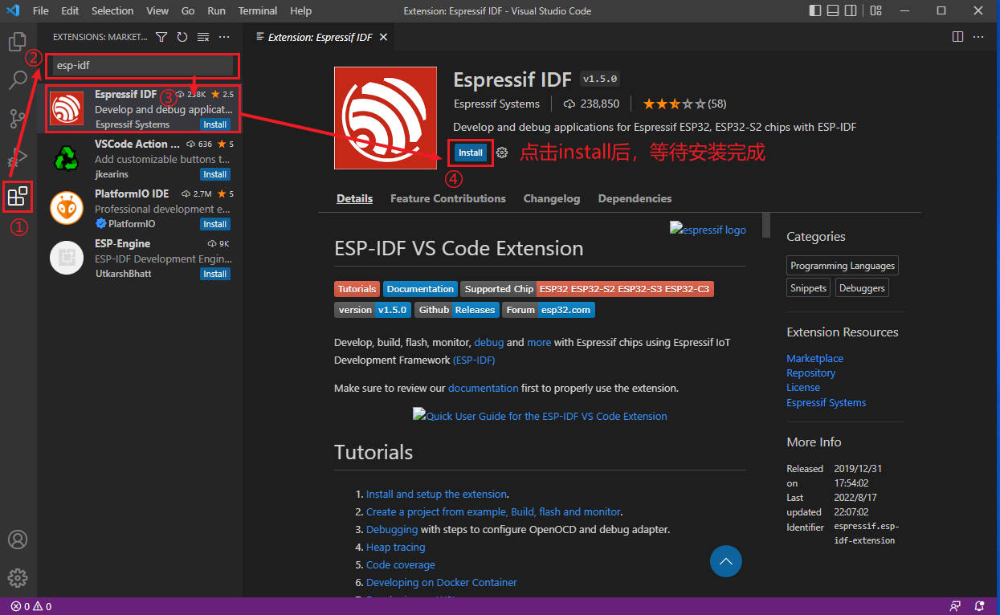
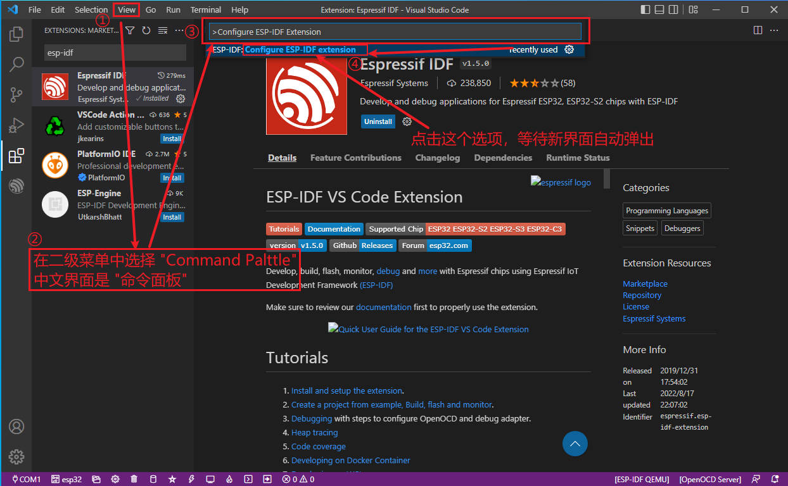
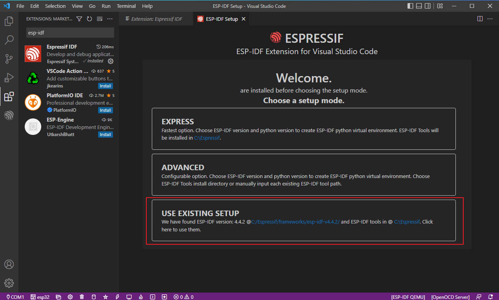

# 基于Windows平台搭建开发环境

Windows应该是大家常见的工作平台，即使是我们这些开发人员也是如此。所以我们也是推荐大家使用Windows平台作为首选的开发环境，并且推荐使用 Windows 10 系统。因为微软官方已经官宣停止对Windows 7 的更新和维护，所以我们最好不好使用windows 7以及比windows 7 更低的版本来搭建开发环境，否则可能会出现各种不必要甚至是无法得到解决的问题。

windows 10还有一个优点是，很多驱动都能自动联网安装，免去了我们手动安装的麻烦，比如我们将 DshanMCU-Mio(澪) 第一次接入我们PC上的时候，如果使用的是 Windwos 10 系统，那么会有弹窗提示正在安装驱动，这是非常智能方便的。

当然了，如果你确实只能使用其他版本的Windows系统，那么在出现问题的时候也是可以在我们的 [交流社区](https://forums.100ask.net/c/esp/49) 提问，会有专业的老师或者热心的同学一起帮你解决问题！


## 安装ESP-IDF

ESP-IDF需要安装一些必备工具，才能围绕 ESP32-S3 构建固件，包括 Python、Git、交叉编译器、CMake 和 Ninja 编译工具等。乐鑫公司官方也有详细的说明文档。

我们现在使用的 DshanMCU-Mio(澪) 主控是ESP32-S3芯片，你也可以根据这个信息在下面这个地址阅读乐鑫公司官方的文档搭建开发环境：

- [https://docs.espressif.com/projects/esp-idf/zh_CN/latest/esp32s3/get-started/index.html](https://docs.espressif.com/projects/esp-idf/zh_CN/latest/esp32s3/get-started/index.html)

如果你阅读乐鑫公司官方的文档搭建好了开发环境，那么下面的内容可以跳过，因为下面的内容其实是基于乐鑫公司官方的文档而编写。

首先我们先将ESP-IDF所需的必备工具安装好，我们只需要前往乐鑫公司的官网文档获取 ESP-IDF 工具安装器，地址是： [https://dl.espressif.cn/dl/esp-idf](https://dl.espressif.cn/dl/esp-idf)

这个安装器在我们的资料包中已经提供了：`03_开发工具/esp-idf-tools-setup-offline-4.4.2.zip`


将压缩包解压后打开进入安装程序：

1. 按照默认的选择安装，直到来到 **安装前系统检查** 步骤的时候，先不要点击下一步，看看 `应用修复` 按钮是否可以点击，如果可以点击那么先点击 `应用修复` 按钮，等待完成后再继续下一步；如果没有，直接点击 `下一步` 按钮：



修复完成，直接点击 `下一步` 按钮：



后面的步骤按照默认的选择继续点击下一步，然后等待安装完成，安装过程中会有些弹窗，提示 是否打开 或者 安装，一律选择 确定 或者 安装 即可，比如这个：


安装完成界面，其他选项不用动，点击 `完成(F)` 按钮：



随后会有弹窗，我们允许其启动即可，最后两个黑色的弹窗都提示 "deno" 即可将其关闭：




> 现在我们已经将 ESP-IDF 开发环境安装好了，但是我们现在只能通过命令行进行编译、烧写、调试等操作，这样不够方便我们进行学习。有很多种方式让我们的操作更直观简单，下面提供了几种搭建可视化操作的环境搭建方式你只需要选择其中一种你认为方便的即可。

### 方式一：windows+vscode+esp-idf

这是推荐的使用方式，依托于 [Visual Studio Code](https://code.visualstudio.com/)(简称vscode) 我们可以很方便地进行代码的编写和项目的烧录，以及debug调试。

这个开发环境搭建方式的步骤其实只有两个：安装vscode、在vscode中安装esp-idf插件。

#### 安装vscode

安装vscode非常简单：

1. 点击这个 [连接](https://code.visualstudio.com) 进入到 vscode 的windows安装包下载页面，下载安装包：[https://code.visualstudio.com](https://code.visualstudio.com)



2. 将安装包下载好之后，双击安装包文件，进入安装程序，前面按照默认的选择点击下一步，到下面这张图所以的页面时建议按照图中所示进行操作，然后点击下一步，后续的步骤按照默认的选择进行直至完成安装：


3. 安装完毕之后打开vscode，其运行界面是这样的：


#### 在 vscode 中安装 ESP-IDF 插件

在上面的小节我们安装好了 vscode，这一小节我们在 vscode 中安装 ESP-IDF 插件，之后我们就可以进行开发了！

在 vscode 的主界面的左侧菜单栏中：点击 **插件(Extensions)** 按钮->输入esp-idf->找到Espressif IDF插件->点击install。也就是如下图所示进行操作：



ESP-IDF 插件安装完毕之后，还不能使用，这是一个基础的插件，我们还需要安装或者适配(如果你已经安装ESP-IDF开发环境) ESP-IDF SDK、Xtensa 交叉编译工具链、OpenOCD等

在 vscode 的顶部菜单栏中，选择：**View->Command Palette** (中文界面是： 查看->命令面板)。在弹出的输入框中输入： `Configure ESP-IDF Extension` 点击输入框下面的选项，等待新界面自动弹出：



在弹出的新界面，如果我们之前已经安装了 ESP-IDF 工具安装器 ，那么这里会提示有三个选择，我们选择最后一个，也就是 `USE EXISTING SETUP`



**如果没有三个选择，也就是只有前面两个选择的时候怎么办？** 如果你有三个选项可用，那么下面这一小部分内容请略过。

我们先看看我们的IDF的安装位置在哪里：
默认安装位置在我们的 `c盘` 也就是系统盘 `C:\Espressif` ，进入到 `C:\Espressif\frameworks` 可以看到我们的 esp-idf-v4.4.2 目录，这个是我们当前使用的 [esp-idf](https://docs.espressif.com/projects/esp-idf/zh_CN/latest/esp32s3/versions.html) 版本。


我们只需要记住或者找到这两个路径即可：

```shell
C:\Espressif
C:\Espressif\frameworks\esp-idf-v4.4.2
```

有了这两个路径之后，我们在 vscode 中打开 **View->Command Palette** (中文界面是： 查看->命令面板) ，输入 `esp-idf`


然后找到 `ESP-IDF: Configure Paths` 点击进入会看到这个菜单，我们配置框出来的两个即可：


先配置 `IDF-PATH` ，点击 `IDF-PATH` 然后在弹出的编辑框输入 esp-idf-v4.4.2 的安装路径，默认是 `C:\Espressif\frameworks\esp-idf-v4.4.2`


然后配置 `IDF-TOOLS-PATH` ，点击 `IDF-TOOLS-PATH` 然后在弹出的编辑框输入 Espressif 的安装路径，默认是  `C:\Espressif` 


然后我们将之前的 `IDF-IDF Setup` 页面关闭，也就是没有第三个选项的那个页面关闭，重新打开： **View->Command Palette** (中文界面是： 查看->命令面板)。在弹出的选项中点击选择： `Configure ESP-IDF Extension` ，等待页面加载出来就能看到有第三个选项了，我们选择最后一个，也就是 `USE EXISTING SETUP`。

> 如果你安装了 esp-idf 的多个版本，那么在切换版本的时候也需要想上面这样操作，并且最后需要重新执行 `USE EXISTING SETUP` 来告知更新我们的 vscode 插件使用新的 esp-idf 版本。

点击后进入新的界面，显示很多步骤已经完成，下拉到最后会看到还有一个在处理，耐心等待它处理完成：


当上面的处理完成之后，会自动来到这个界面，说明已经成功了！


## 开发套件的使用

### 安装驱动

按照上面的操作，我们已经配置好开发环境，下面我们再来看看怎么在 **vscode + ESP-IDF** 中使用 DshanMCU-Mio(澪) 进行开发。

我们将 DshanMCU-Mio(澪) 上印有 UART 的 Type-C 接口，通过配套的 Type-C 线连接到我们的PC上的USB接口上，如下图所示：


在 Windows 10 操作系统中，一般在你接上之后不久就会提示正在自动安装驱动。

我们右键点击 **“我的电脑”** ，然后依次点击： 属性->设备管理。打开 **设备管理器** 界面之后能看到 `端口(COM和LPT)`选项， 并且其中有新接入的设备串口(COM)号，说明驱动没有问题，可以正常使用。


如果 **驱动异常**，那么就是你PC的系统无法自动安装驱动，这时候就需要我们 **手动安装驱动** ，方法如下：

如果驱动异常，我们新接入的设备会显示一个 **黄色的感叹号**，我们选中这个设备项，然后点击鼠标右键，在弹出的菜单栏中选择 `更新驱动程序`：


然后会弹出一个页面，我们选择 `“浏览计算机查找驱动”`：

驱动的路径选择： `DShan-ESP-S3_Arduino学习资料\03_开发工具\`，点击 `“确定”` 后就会安装驱动。


驱动安装完成之后，再检查 **设备管理器** 中是否有串口(COM)号。

> 资料中的驱动是压缩包，我们要先解压这个压缩包再选择驱动，这里略过解压操作教程。


至此，我们已经将开发环境准备好了，已经可以用于后续的开发、学习使用！
