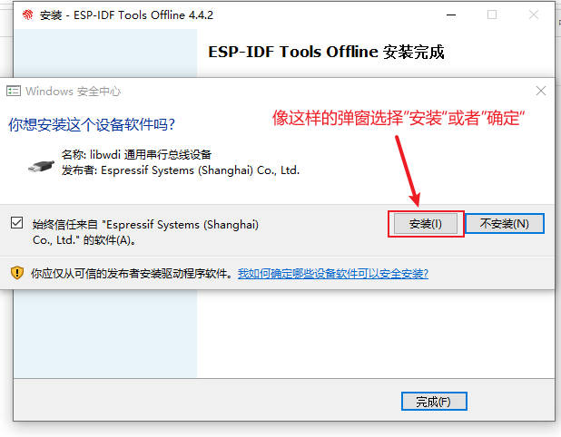
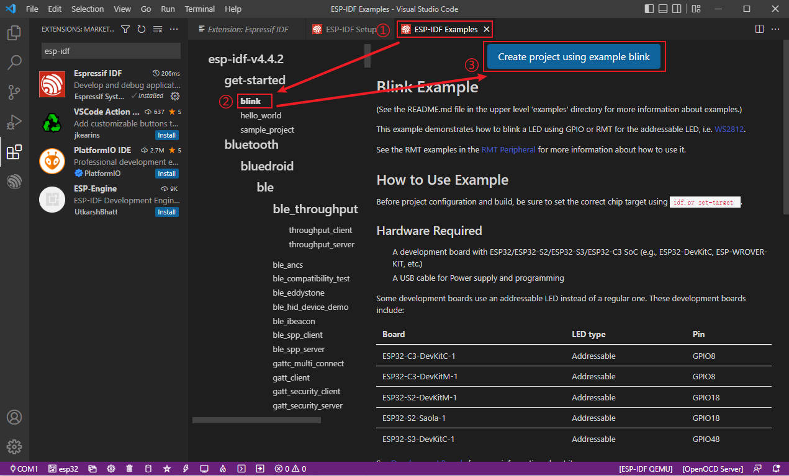
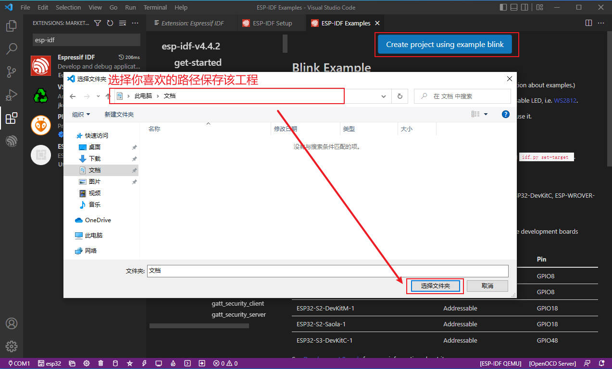
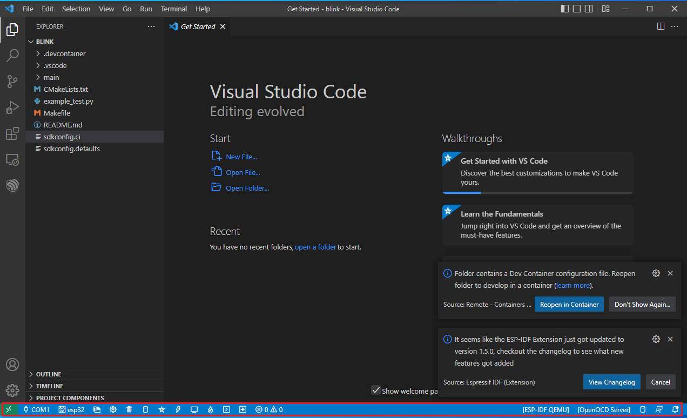
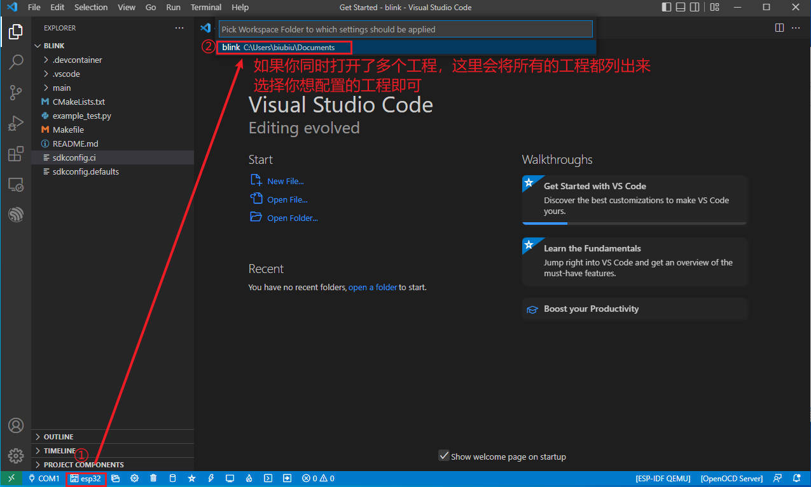
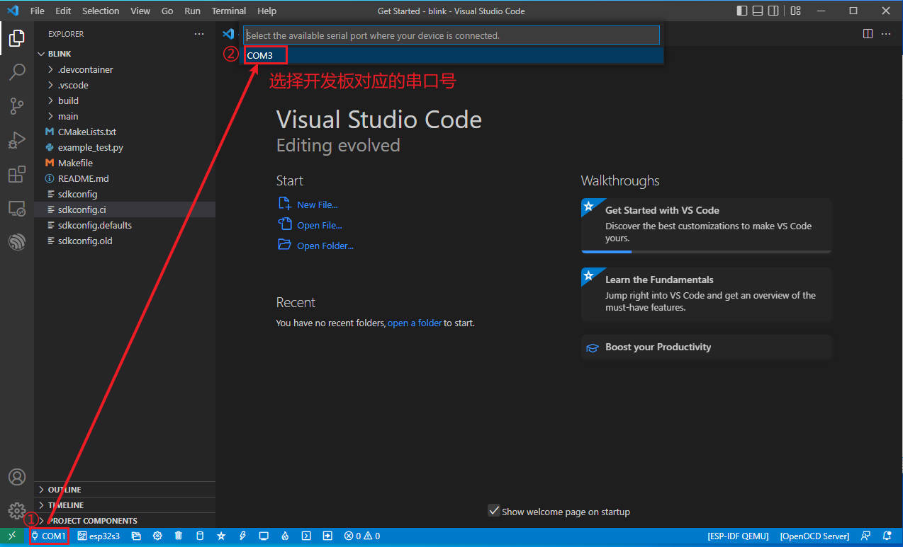
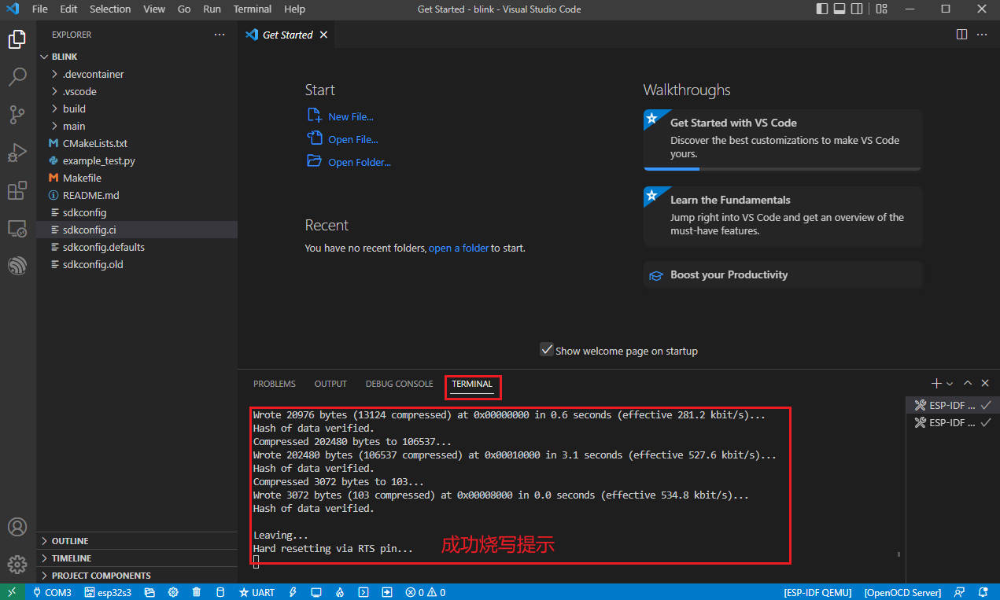
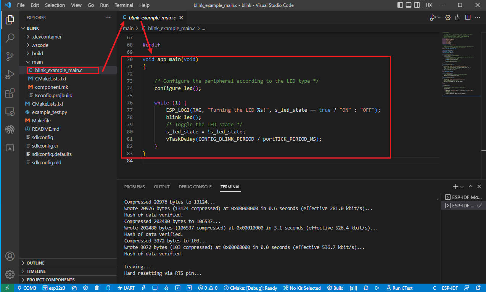
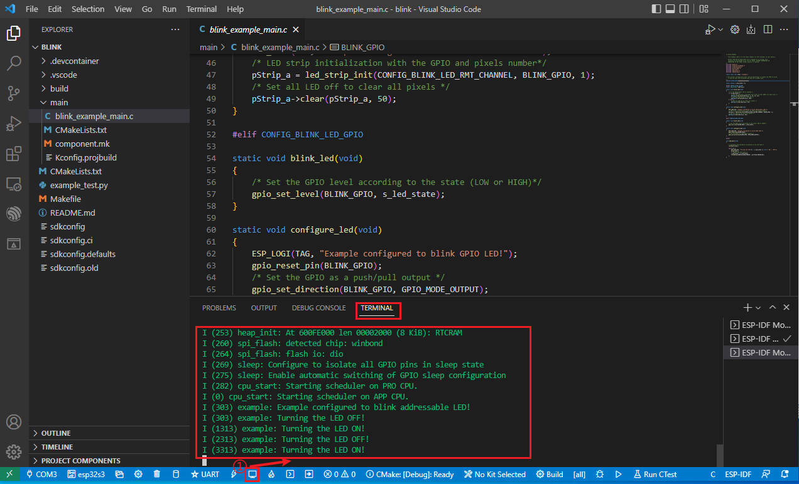

# 第二章 快速搭建开发环境

在上一章节中，我们了解了什么是ESP32、什么是ESP-IDF。我们已经对这两个方面有了一定的了解，万事俱备，只欠东风。在正式开始学习或者说编程之前，我们还需要将我们的开发环境搭建起来。

搭建开发环境我们离不开两个东西： 硬件平台+软件平台。

下面我们就来动手将我们的 DshanMCU-Mio(澪) + ESP-IDF 开发环境搭建起来。这其中我们提供了多种系统平台的搭建方法，你只需要选择你常用的一种平台即可，比如你的PC使用的是Windwos系统，那么只需要看 Windows 平台的部分即可。

在搭建环境之前，我们需要先获取到学习资料包，下面我们先来看看 DshanMCU-Mio(澪) 怎么学习资料。

## 获取学习资料

[DShanMCU-Mio(澪)](https://forums.100ask.net/t/topic/1033)学习资料 [百度云盘](http://wiki.100ask.org/BeginnerLearningRoute#.E7.99.BE.E5.BA.A6.E7.BD.91.E7.9B.98.E4.BD.BF.E7.94.A8.E6.95.99.E7.A8.8B) 下载

| 学习平台 | 链接 | 提取码|
| :--- | :--- | --- |
| Arduino | [https://pan.baidu.com/s/1rpC0JZj6wZ2wea3NyPXTvQ?pwd=root](https://pan.baidu.com/s/1rpC0JZj6wZ2wea3NyPXTvQ?pwd=root) | root|
| ESP-IDF| [https://pan.baidu.com/s/1lNVxmixhmOdPFSmtCMUMbg?pwd=root ](https://pan.baidu.com/s/1lNVxmixhmOdPFSmtCMUMbg?pwd=root) | root|
| Micropython | TODO | TODO |

> 获取最新的学习资料包，可以在上面的云盘下载来链接中获取，也可以关注我们的git仓库获取，同时非常欢迎提交你的 issues 或 Pull requests ！

示例、组件、库源码地址：

| 仓库名称 | 源码地址 | 说明 |
| :--- | :--- | --- |
| esp-arduino-learn  | [https://github.com/100askTeam/esp-idf-learn](https://github.com/100askTeam/esp-idf-learn) | Arduino 平台学习资料包 |
| esp-idf-learn | [https://github.com/100askTeam/esp-idf-learn](https://github.com/100askTeam/esp-idf-learn) | ESP-IDF 平台学习资料包 |
| esp-idf-components | [https://github.com/100askTeam/esp-idf-components](https://github.com/100askTeam/esp-idf-components) | ESP-IDF 平台的学习资料包的组件作为[esp-idf-learn](https://github.com/100askTeam/esp-idf-learn) 的子模块，也可以单独在自己的项目中使用！ |
| esp-micropython-learn | TODO | MicroPython 平台学习资料包 |


## 基于Windows平台

Windows应该是大家常见的工作平台，即使是我们这些开发人员也是如此。所以我们也是推荐大家使用Windows平台作为首选的开发环境，并且推荐使用 Windows 10 系统。因为微软官方已经官宣停止对Windows 7 的更新和维护，所以我们最好不好使用windows 7以及比windows 7 更低的版本来搭建开发环境，否则可能会出现各种不必要甚至是无法得到解决的问题。

windows 10还有一个优点是，很多驱动都能自动联网安装，免去了我们手动安装的麻烦，比如我们将 DshanMCU-Mio(澪) 第一次接入我们PC上的时候，如果使用的是 Windwos 10 系统，那么会有弹窗提示正在安装驱动，这是非常智能方便的。

当然了，如果你确实只能使用其他版本的Windows系统，那么在出现问题的时候也是可以在我们的 [交流社区](https://forums.100ask.net/c/esp/49) 提问，会有专业的老师或者热心的同学一起帮你解决问题！


### 安装ESP-IDF

ESP-IDF需要安装一些必备工具，才能围绕 ESP32-S3 构建固件，包括 Python、Git、交叉编译器、CMake 和 Ninja 编译工具等。乐鑫公司官方也有详细的说明文档。

我们现在使用的 DshanMCU-Mio(澪) 主控是ESP32-S3芯片，你也可以根据这个信息在下面这个地址阅读乐鑫公司官方的文档搭建开发环境：

- [https://docs.espressif.com/projects/esp-idf/zh_CN/latest/esp32s3/get-started/index.html](https://docs.espressif.com/projects/esp-idf/zh_CN/latest/esp32s3/get-started/index.html)

如果你阅读乐鑫公司官方的文档搭建好了开发环境，那么下面的内容可以跳过，因为下面的内容其实是基于乐鑫公司官方的文档而编写。

首先我们先将ESP-IDF所需的必备工具安装好，我们只需要前往乐鑫公司的官网文档获取 ESP-IDF 工具安装器，地址是： [https://dl.espressif.cn/dl/esp-idf](https://dl.espressif.cn/dl/esp-idf)

这个安装器在我们的资料包中已经提供了：`03_开发工具/esp-idf-tools-setup-offline-4.4.2.zip`


将压缩包解压后打开进入安装程序：

1. 按照默认的选择安装，直到来到 **安装前系统检查** 步骤的时候，先不要点击下一步，看看 `应用修复` 按钮是否可以点击，如果可以点击那么先点击 `应用修复` 按钮，等待完成后再继续下一步；如果没有，直接点击 `下一步` 按钮：


修复完成，直接点击 `下一步` 按钮：


后面的步骤按照默认的选择继续点击下一步，然后等待安装完成，安装过程中会有些弹窗，提示 是否打开 或者 安装，一律选择 确定 或者 安装 即可，比如这个：



安装完成界面，其他选项不用动，点击 `完成(F)` 按钮：


随后会有弹窗，我们允许其启动即可，最后两个黑色的弹窗都提示 "deno" 即可将其关闭：


> 现在我们已经将 ESP-IDF 开发环境安装好了，但是我们现在只能通过命令行进行编译、烧写、调试等操作，这样不够方便我们进行学习。有很多种方式让我们的操作更直观简单，下面提供了几种搭建可视化操作的环境搭建方式你只需要选择其中一种你认为方便的即可。

#### 方式一：windows+vscode+esp-idf

这是推荐的使用方式，依托于 [Visual Studio Code](https://code.visualstudio.com/)(简称vscode) 我们可以很方便地进行代码的编写和项目的烧录，以及debug调试。

这个开发环境搭建方式的步骤其实只有两个：安装vscode、在vscode中安装esp-idf插件。

##### 安装vscode

安装vscode非常简单：

1. 点击这个 [连接](https://code.visualstudio.com) 进入到 vscode 的windows安装包下载页面，下载安装包：[https://code.visualstudio.com](https://code.visualstudio.com)


2. 将安装包下载好之后，双击安装包文件，进入安装程序，前面按照默认的选择点击下一步，到下面这张图所以的页面时建议按照图中所示进行操作，然后点击下一步，后续的步骤按照默认的选择进行直至完成安装：


3. 安装完毕之后打开vscode，其运行界面是这样的：


##### 在 vscode 中安装 ESP-IDF 插件

在上面的小节我们安装好了 vscode，这一小节我们在 vscode 中安装 ESP-IDF 插件，之后我们就可以进行开发了！

在 vscode 的主界面的左侧菜单栏中：点击 **插件(Extensions)** 按钮->输入esp-idf->找到Espressif IDF插件->点击install。也就是如下图所示进行操作：


ESP-IDF 插件安装完毕之后，还不能使用，这是一个基础的插件，我们还需要安装或者适配(如果你已经安装ESP-IDF开发环境) ESP-IDF SDK、Xtensa 交叉编译工具链、OpenOCD等

在 vscode 的顶部菜单栏中，选择：**View->Command Palette** (中文界面是： 查看->命令面板)。在弹出的输入框中输入： `Configure ESP-IDF Extension` 点击输入框下面的选项，等待新界面自动弹出：


在弹出的新界面，如果我们之前已经安装了 ESP-IDF 工具安装器 ，那么这里会提示有三个选择，我们选择最后一个，也就是 `USE EXISTING SETUP`


**如果没有三个选择，也就是只有前面两个选择的时候怎么办？** 如果你有三个选项可用，那么下面这一小部分内容请略过。

我们先看看我们的IDF的安装位置在哪里：
默认安装位置在我们的 `c盘` 也就是系统盘 `C:\Espressif` ，进入到 `C:\Espressif\frameworks` 可以看到我们的 esp-idf-v4.4.2 目录，这个是我们当前使用的 [esp-idf](https://docs.espressif.com/projects/esp-idf/zh_CN/latest/esp32s3/versions.html) 版本。


我们只需要记住或者找到这两个路径即可：

```shell
C:\Espressif
C:\Espressif\frameworks\esp-idf-v4.4.2
```

有了这两个路径之后，我们在 vscode 中打开 **View->Command Palette** (中文界面是： 查看->命令面板) ，输入 `esp-idf`


然后找到 `ESP-IDF: Configure Paths` 点击进入会看到这个菜单，我们配置框出来的两个即可：


先配置 `IDF-PATH` ，点击 `IDF-PATH` 然后在弹出的编辑框输入 esp-idf-v4.4.2 的安装路径，默认是 `C:\Espressif\frameworks\esp-idf-v4.4.2`


然后配置 `IDF-TOOLS-PATH` ，点击 `IDF-TOOLS-PATH` 然后在弹出的编辑框输入 Espressif 的安装路径，默认是  `C:\Espressif` 


然后我们将之前的 `IDF-IDF Setup` 页面关闭，也就是没有第三个选项的那个页面关闭，重新打开： **View->Command Palette** (中文界面是： 查看->命令面板)。在弹出的选项中点击选择： `Configure ESP-IDF Extension` ，等待页面加载出来就能看到有第三个选项了，我们选择最后一个，也就是 `USE EXISTING SETUP`。

点击后进入新的界面，显示很多步骤已经完成，下拉到最后会看到还有一个在处理，耐心等待它处理完成：


当上面的处理完成之后，会自动来到这个界面，说明已经成功了！


### 开发套件的使用

#### 安装驱动

按照上面的操作，我们已经配置好开发环境，下面我们再来看看怎么在 **vscode + ESP-IDF** 中使用 DshanMCU-Mio(澪) 进行开发。

我们将 DshanMCU-Mio(澪) 上印有 UART 的 Type-C 接口，通过配套的 Type-C 线连接到我们的PC上的USB接口上，如下图所示：


在 Windows 10 操作系统中，一般在你接上之后不久就会提示正在自动安装驱动。

我们右键点击 **“我的电脑”** ，然后依次点击： 属性->设备管理。打开 **设备管理器** 界面之后能看到 `端口(COM和LPT)`选项， 并且其中有新接入的设备串口(COM)号，说明驱动没有问题，可以正常使用。


如果 **驱动异常**，那么就是你PC的系统无法自动安装驱动，这时候就需要我们 **手动安装驱动** ，方法如下：

如果驱动异常，我们新接入的设备会显示一个 **黄色的感叹号**，我们选中这个设备项，然后点击鼠标右键，在弹出的菜单栏中选择 `更新驱动程序`：


然后会弹出一个页面，我们选择 `“浏览计算机查找驱动”`：

驱动的路径选择： `DShan-ESP-S3_Arduino学习资料\03_开发工具\`，点击 `“确定”` 后就会安装驱动。


驱动安装完成之后，再检查 **设备管理器** 中是否有串口(COM)号。

> 资料中的驱动是压缩包，我们要先解压这个压缩包再选择驱动，这里略过解压操作教程。


#### 编译烧写程序

按照上面小节的操作，我们的驱动没有问题可以使用之后，我们就可以在 **vscode + ESP-IDF** 中和我们手上的 DshanMCU-Mio(澪) 进行交互了，我们先来烧写一个程序。

##### 打开示例工程(blink)
首先，我们打开一个简单的示例代码： 

1.  在 vscode 的顶部菜单栏中，选择：**View->Command Palette** (中文界面是： 查看->命令面板)。在弹出的输入框中输入： `ESP-IDF:Show Examples Projects` 点击输入框下面的 `ESP-IDF:Show Examples Projects` 选项：


然后会提示 `Use current ESP-IDF(C:/Espressif/framewoks/esp-idf-v4.4.2/) ESP-IDF`，我们继续点击选择它：


然后等待新界面自动弹出，我们选择 **blink** 示例，然后点击右上角的 `Create project using example blink` 按钮：



然后会提示你将工程保存在哪里，我这里保存在文档目录下，你可以选择你喜欢的目录：



这样我们就打开了 `blink` 示例工程，我现在的界面是这样的，但是这是异常的状态，我们先按照图中所示进行操作：


然后关闭 vscode 软件，再重新打开，会看到底部多出来很多小图标，这才是正常的状态：



这样我们的工程已经是就绪好了，我们接着下一小节的内容进行操作。

##### 配置、编译、烧录、验证

###### 配置

按照上面的操作，我们打开了 `blink` 工程，在编译之前，我们要先告诉ESP-IDF插件，我们所使用的开发板、串口号等信息。

**我们先配置开发板：**

1. 首先我们配置我们所使用的芯片，DshanMCU-Mio(澪)的主控芯片是ESP32-S3，所以我们要按照下面的图所示选择 `ESP32-S3` ：

选择你要配置的项目



2. 然后，选择 ESP32-S3


3. 接着再选择 `via ESP USB Bridge`


4. 最后等待配置完成：


**接着再配置串口号：**




###### 编译

配置好之后，我们点击下图所示的图标等待编译完成：


###### 烧写

编译完成后，我们将程序烧写到我们的开发板中：

点击编译图标后选择 `UART` :


然后选择要烧写的项目：


等待烧写完成：



###### 验证
 
我们先看到 blink 工程的 main 函数，在一个while(1)循环中，会看到有串口打印LED灯的状态信息，并且会改变LED的状态(亮灭)：



这时候我们打开串口终端，查看开发板的输出信息，点击如下图所示的图标：



可以看到，每隔一秒输出一次LED灯的状态信息，但是我们看不到开发板有灯闪烁。因为 DshanMCU-Mio(澪) 本身没有板载可编程的LED灯，而我们的 blink 示例中控制 LED 使用的引脚是 48 号引脚，我们可以将 PIN 48 上一个 LED 灯就能看到LED闪烁了。


## 基于Linux平台(Ubuntu)
待续...

## 基于MacOS平台
待续...


