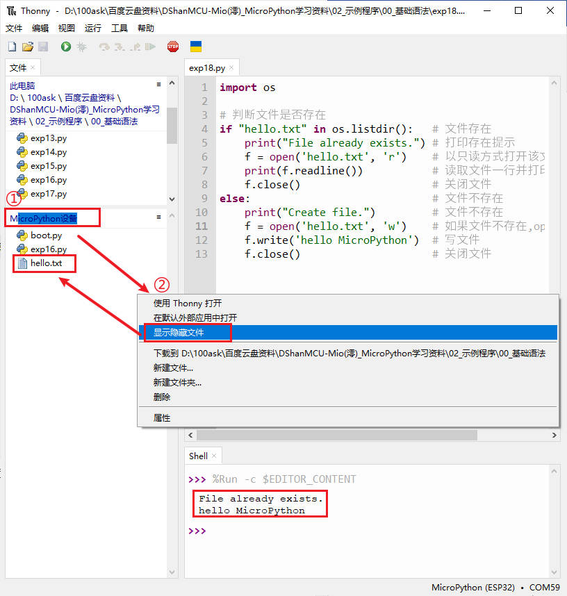

# 文件操作

DshanMCU-Mio(澪) 开发板自身的Flash足够大，所以不许要TF卡也能支持文件系统。在这个文件系统里，我们可以进行文件的创建、修改、删除等操作。

如下代码段所示，先判断文件是否存在，存在就打印内容，不存在就创建，写入文件。

```python
# 文件操作示例（exp18.py）

import os

# 判断文件是否存在
if "hello.txt" in os.listdir():   # 文件存在
    print("File already exists.") # 打印存在提示
    f = open('hello.txt', 'r')    # 以只读方式打开该文件
    print(f.readline())           # 读取文件一行并打印
    f.close()                     # 关闭文件
else:                             # 文件不存在
    print("Create file.")         # 文件不存在       
    f = open('hello.txt', 'w')    # 如果文件不存在,open就是创建文件
    f.write('hello MicroPython')  # 写文件
f.close()                     # 关闭文件

```

首次执行shell窗口提示结果如下：

```shell
Create file.
```

接着再执行一次，可以在shell窗口中看到如下信息：

```shell
File already exists.
hello MicroPython
```

这个时候我们在 MicroPython设备 窗口，按下鼠标右键在弹出的菜单栏中选择 `显示隐藏文件` 选项，就能看到 "hello.txt" 文件，如下图所示：



> 在 Thonny 中默认只会识别并显示 .py 后缀的文件，如果是其他文件会被Thonny认为是无法识别使用的文件而被屏蔽起来。
