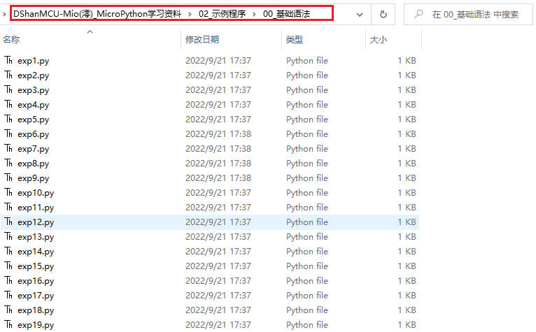
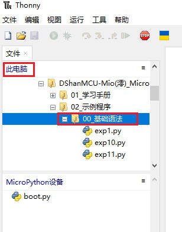
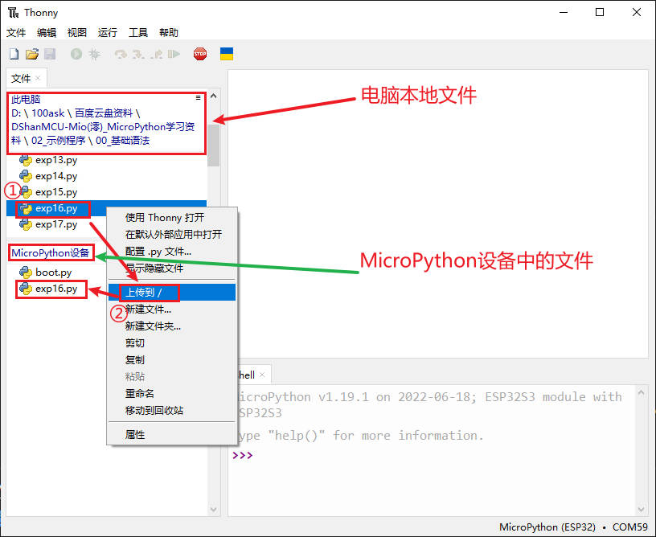

# 第三章 MicroPython基础知识

MicroPython设计的初衷是用于控制硬件，尽管MicroPython努力与桌面版的Python尽可能的兼容，但由于微控制器有限的资源环境，它并非支持所有Python的库和功能。

如果有Python基础，再学习MicroPython是很容易的事，但不是所有的Python语法都适用于MicroPython，这点要尤为注意。本章讲解的Python语法，同时适用于Python和MicroPython。

有Python基础的同学，可以直接跳过本章，直接学习如何操作硬件。如果没有Python基础，可以先通过本章，快速了解一些Python/MicroPython的基础语法知识。

本章涉及的示例程序所在的路径：`DShanMCU-Mio(澪)_MicroPython学习资料/02_示例程序/00_基础语法`



## 注释

注释是指在代码中加入辅助说明信息，不会被执行，帮助别人或者自己辅助阅读程序。注释必须要符合相应的规则，否则会被当作代码内容，导致编译无法通过。

Python中有两类注释方式：单行注释和多行注释。

Python中单行注释以“#”开头，适合注释当前行代码。

Python中多行注释使用三个英文单引号  `'''` 或三个英文双引号 `"""` ，适合注释多行代码。

如下面的代码段所示：

```python
# 这是单行注释

'''
这是多行注释
注意是英文单引号
'''

"""
这是也是多行注释
使用的是英文双引号
"""

print("Hello, Python and MicroPython~") # 这才是代码内容

```

## 缩进

Python不同于其它编程语言（比如C语言），它的的代码块不使用大括号“{} ”来控制，而是使用缩进来控制。

如以下代码段所示。缩进的空白数量是可变的，但是所有代码块语句必须包含相同的缩进空白数量，通常缩进为四个空格。

```python
if True:
    print ("TEST")  # 正确的缩进，编译正常
    print ("OK")    # 正确的缩进，编译正常
  print ("ERROR")   # 错误的缩进，编译不过，需要删除/调整后才能通过编译
```

## 打印

我们在 **交互式编程** 情况下，输入要计算的代码，终端会显示运算结果。在 **脚本式编程** 情况下，终端不会显示运算结果，此时需要使用 `print` 将结果打印出来。
如以下代码段所示。“print”可以打印数字、字符串、变量，以及这些的任何组合。

```python
# 在交互式编程情况下，终端会显示运算结果
# 在脚本式编程情况下，终端不会显示运算结果
100+200 

print(100+200)   # 需要通过print函数打印运算结果

print(100)       # 打印数字
print("hello")   # 打印字符串,需要引号括起来
a=100 
s="hello"
print(a, s)      # 打印变量
print("a =", a)  # 打印字串串和变量的组合
print("a=%d"%(a) + "s=%s"%(s))  # 打印格式化输出

```

## 运算符

我们编写的代码中，最多是的就是运算，比如“100+200”，“100”和“200”是操作数，“+”是运算符。Python中的运算符，除了加减乘除，还有众多其它类型的运算符。

### 算术运算符

Python支持的算术运算符如下表所示，是编程中最多使用的运算符。

| 运算符 | 说明 |
| :---   | :--- |
| +      | 加：两个操作数相加 |
| -      | 减：两个操作数相减或得到一个负数 |
| *      | 乘：两个操作数相乘或让一个字符串重复若干次 |
| /      | 除：两个操作数相除 |
| **     | 乘方：两个操作数乘方 |
| //     | 整除：两个操作数相除，向下取整数部分 |
| %      | 模除：两个操作数相除，得到余数 |


算数运算符示例如下代码段所示:

```python
# 加法
a=100+200
print("100 + 200 =", a)

# 减法
a=100-200
b=-10
print("100 - 200 =", a)
print("b =", b)

# 乘法
a=4*5
print("4 * 5 =", a)
print("test "*4)

# 除法
a=4/5
print("4 / 5 =", a)

# 乘方
a=2**4
print("2 ** 4 =", a)

# 整除
a=13//5
print("13 // 5 =", a)

# 模除
a=13%5
print("13 % 5 =", a)

```

执行结果如下：

```shell
100 + 200 = 300
100 - 200 = -100
b = -10
4 * 5 = 20
test test test test 
4 / 5 = 0.8
2 ** 4 = 16
13 // 5 = 2
13 % 5 = 3
```

> 有时候，"a=a+b",也被写作 "a+=b" ，这是一种简写方式，即 `变量 = 变量 运算 表达式` 简写成 `变量 运算 = 表达式`。同理其它算术运算符，也能这样简写，比如 "a=a*b" ，简写为 "a*=b"。

### 比较运算符

Python支持的比较运算符如下表所示，返回结果为 `True` 或 `False` ，通常用于条件判断，实现代码分支执行。

| 运算符 | 说明 |
| :---   | :--- |
| >      | 大于：x是否大于y |
| <>     | 小于：x是否小于y |
| >=     | 大于等于：x是否大于或等于y |
| <=     | 小于等于：x是否小于或等于y |
| ==     | 等于：比较两个对象是否相等 |
| !=     | 不等于：比较两个对象是否不相等 |

比较运算符示例如下代码段所示：

```python
# 大于>
a=200>100
print("200>100 is:", a)

# 小于>
a=200<100
print("200<100 is:", a)

# 大于等于>=
a=200>=100
print("200>=100 is:", a)

# 小于等于<=
a=200<=100
print("200<=100 is:", a)

# 等于==
a=200==100
print("200==100 is:", a)

# 不等于！=
a=200!=100
print("200!=100 is:", a)

# 应用
a=200
b=100
if a>b:
    print("a>b")
else:
print("a<b")

```

执行结果如下：

```shell
200>100 is: True
200<100 is: False
200>=100 is: True
200<=100 is: False
200==100 is: False
200!=100 is: True
a>b
```

### 位运算符

Python支持的位运算符如下表所示。位运算大家可能比较陌生，但有过单片机开发的同学，对此应该不会陌生。由于是通过修改寄存器，从而实现对单片机外设的控制，而对寄存器的某一位操作，则称之为位操作。在进行位运算时，要把计算的数字看作二进制，这样才好理解位运算。

| 运算符 | 说明 |
| :---   | :--- |
| &      | 按位与：当两个数，对应位都为1，该位就为1，否则为0 |
| |      | 按位或：当两个数，对应位只要有一个为1，该位就为1，否则为0 |
| ^      | 按位异或：当两个数，对应位只要相异（不同），该位就为1，否则为0 |
| ~      | 按位取反：把这个数的每一位，1变0，0变1 |
| <<     | 左移：把这个数的每一位，全部左移若干位，高位丢弃，低位补0 |
| >>     | 右移：把这个数的每一位，全部右移若干位，低位丢弃，高位补0等 |

位运算符示例如下代码段所示。

```python
a=45  # 二进制为0010 1101
b=25  # 二进制为0001 1001
print("a =" ,a, "b =", b)

# 按位与&
c=a&b   # 二进制对应位，都为1，结果为1，否则为0，结果为：0000 1001，即为9
print("a&b =", c) 

# 按位或|
c=a|b   # 二进制对应位，只要有1个为1，结果为1，否则为0，结果为：0011 1101，即为61
print("a|b =", c) 

# 按位异或^
c=a^b   # 二进制对应位，只要相异(不同)，结果为1，否则为0，结果为：0011 0100，即为52
print("a^b =", c) 

# 按位取反~
c=~a   # 把这个数二进制的每一位，1变0，0变1，结果为：1101 0010(此时最高位是符号位)，即为-46
print("~a =", c) 

# 左移<<
c=a<<2   # 把这个数二进制的每一位，全部左移2位，高位丢弃，低位补0，结果为：1011 0100，即为180
print("a<<2 =", c) 

# 右移>>
c=a>>2   # 把这个数二进制的每一位，全部右移2位，低位丢弃，高位补0，结果为：0000 1011，即为11
print("a>>2 =", c) 

```

执行结果如下：

```shell
a = 45 b = 25
a&b = 9
a|b = 61
a^b = 52
~a = -46
a<<2 = 180
a>>2 = 11
```

### 逻辑运算符

Python支持的逻辑运算符如下表所示。需要注意的是，逻辑运算存在 **短路计算** ，一旦前者满足条件，就不会管后续的判断。

| 运算符 | 说明 |
| :---   | :--- |
| and    | 布尔**与**：x and y，如果x为False，返回False，否则返回y |
| or     | 布尔**或**：x or y，如果x为Ture，返回True，否则返回y |
| not    | 布尔**非**：not x，如果x为True，返回False，如果x为False，它返回True |

逻辑运算符示例如下代码段所示：

```python
x=10
y=20 

# 与and
print("x =" ,x, "y =", y)
z = x and y
print("x and y =", z)

x=False
print("x =" ,x, "y =", y)
z = x and y
print("x and y =", z)

print("----------------")

# 或or
x=10
print("x =" ,x, "y =", y)
z = x or y
print("x or y =", z)

x=False
print("x =" ,x, "y =", y)
z = x or y
print("x or y =", z)

print("----------------")

# 非not
x=10
y=20
print("x =" ,x, "y =", y)
z = not x
print("not x =", z)
```

执行结果如下：

```shell
x = 10 y = 20
x and y = 20
x = False y = 20
x and y = False
----------------
x = 10 y = 20
x or y = 10
x = False y = 20
x or y = 20
----------------
x = 10 y = 20
not x = False
```

> 最后，运算符的优先级基本和我们日常习惯相符，比如乘法运算优先级高于加法运算优先级，对于不确定的情况，我们可以使用括号“( )”来调整优先级。

## 控制流

前面大部分示例，我们都是先执行运算，再打印运算结果，从头到尾，依次执行每句代码内容。但在实际开发中，我们通常需要设备根据不同的情况，自动的执行相应的代码。这就需要引入控制流语句，在Python中，控制流语句有三个：`if``、while` 和 `for。`

### if条件语句

CPU会先去运行 `if` 后面的语句，如果这个语句执行结果为Ture（非0和非null），则执行下一个缩进里的代码块。如果这个语句执行结果为Flase（0或null），则去执行 `else` 后的代码块。 `else` 部分是可选的，可以不写这部分。
如下代码段所示，当出现多个判断情况时，可以使用 `elif`，实现多次判断。


```python
x=10
y=20 

# 仅有if
if x>y:
    print("x>y")

# 有if和else
if x==y:
    print("x==y")
else:
    print("x!=y")

# 多次判断
if x==y:
    print("x==y")
elif x>y:
    print("max:", x)
elif y>x:
print("max:", y)

```

执行结果如下：


```shell
x!=y
max: 20
```

### while循环语句

CPU会先去运行 `while` 后面的语句，如果这个语句执行结果为Ture（非0和非null），则执行下一个缩进里的代码块。如果这个语句执行结果为Flase（0或null），则去执行 “else” 后的代码块。“else”部分是可选的，可以不写这部分。不同于 “if” 只会执行一次，“while”会再次执行，直到判断结果为 Flase。

如下代码段所示，实现让打印执行指定次数。


```python
x=10

while (x > 0):
    print("x value =:", x)
    x = x-1 # 修改判断依据,让x每次减1
else:
    print("end")
```

执行结果如下所示：

```shell
x value =: 10
x value =: 9
x value =: 8
x value =: 7
x value =: 6
x value =: 5
x value =: 4
x value =: 3
x value =: 2
x value =: 1
end
```

在某些情况下，我们可以让 “while” 的判断语句永远为True，实现**无限循环**的效果。
此外，“while”还可以配合“continue”和“break”，实现跳过本次循环和退出循环，如下代码段所示。

跳过/跳出循环（exp10.py）

```python
x=10

while True: # 恒为Ture,无限循环
    x = x-1 
    if x%2==0:   # 如果除2余0,说明是偶数
        continue # 跳过本次循环
    else:
        print("x value =:", x)

    if x<0:      # 如果x为负数
        break    # 结束循环
```

执行结果如下：

```shell
x value =: 9
x value =: 7
x value =: 5
x value =: 3
x value =: 1
x value =: -1
```

### for循环语句

`for`也是循环，和 “while” 的区别在于，它会遍历后面序列中的每一个项目，这个序列可以是列表，也可以是字符串。
如下代码段所示，可以遍历字符串、列表、数字范围等。

for循环语句（exp11.py）

```python
# 遍历字符串中每个字符
for letter in "MicroPython":
    print("letter is", letter)

# 遍历列表中每个元素
languages = ["Chinese", "Spanish", "English", "Japanese"]
for i in languages:        
   print('Supported languages: ', i)

# 根据范围遍历
for i in range(10, 15):        
   print('i =: ', i)

# 根据索引遍历
languages = ["Chinese", "Spanish", "English", "Japaniese"]
for i in range(len(languages)):        
   print('Supported languages: ', languages[i])

```

执行结果如下：

```shell
letter is M
letter is i
letter is c
letter is r
letter is o
letter is P
letter is y
letter is t
letter is h
letter is o
letter is n
Supported languages:  Chinese
Supported languages:  Spanish
Supported languages:  English
Supported languages:  Japanese
i =:  10
i =:  11
i =:  12
i =:  13
i =:  14
Supported languages:  Chinese
Supported languages:  Spanish
Supported languages:  English
Supported languages:  Japaniese

```

## 函数

函数是指可以重复使用的程序片段。函数可以让代码有模块性，提高代码的重复利用率。在目前为止，我们已经使用过了不少Python提供的内建函数，比如“print()”、“rang()”、“len()”。我们也可以自己创建函数，这叫做用户自定义函数。

### 函数的定义

一个函数使用 `def` 关键字开头，之后是这个函数的名字，再是圆括号“()”，这里的圆括号用来传入参数。下一行缩进就是函数的内容，其中第一行可以用字符串写函数的说明。最后，可选“return”作为函数的返回结果。
如下代码段所示，先定义函数，再多次调用函数。

自定义函数示例（exp12.py）


```python
def print_hello():    # 定义一个函数
   "功能: 打印hello"
   print("hello ")
   return

print_hello()         # 调用函数
print_hello()         # 再次调用函数

```

执行结果如下所示：

```shell
hello 
hello
```

### 函数的参数
一个函数支持传入参数，才会让这个函数更具可重复使用性。这个参数由调用函数时传入，在定义函数时，需要先设计好支持哪些参数。
如下代码段所示，几种常见的参数传入方式。

函数参数示例（exp13.py）


```python
def max_num(a, b=0):   # 设置b为默认参数
    "功能: 打印两个数字中较大的一个"
    if a>b:
        print(a, "is maximun")
    elif a<b:
        print(b, "is maximun")
    else:
        print(a, "is equal to", b)

max_num(15, 17)      # 正常调用函数，为默认顺序
max_num(-27)         # 只传入参数a,参数b为默认值
max_num(b=-7, a=-10) # 指定传给哪一个参数
```

执行结果如下所示：

```shell
17 is maximun
0 is maximun
-7 is maximun
```

### 变量的作用域
编写函数时，需要注意变量的作用域，变量的作用域有两种：全局变量和局部变量。

全局变量在函数外定义，也可在任意位置，使用 `global` 声明变量是全局变量，其它函数在任何位置都可以访问全局变量。

局部变量在函数内定义，只能被当前函数内部访问。

如下代码段所示：

```python
# 变量的作用域示例（exp14.py）
x = 10       # 在函数外面,定义的变量,是全局变量,大家都可以访问

def func1():  
    y = 30    # 在函数里面,定义的变量,是局部变量,只能当前函数内部访问
    global z  # 在函数里面,使用global声明变量是一个全局变量,大家都可以访问
    z = 50   
    print("fun1 x =", x)
    print("fun1 y =", y)
    print("fun1 z =", z)

def func2():  
    y = 40
    print("fun2 x =", x) # 打印来在函数外,定义的全局变量
    print("fun2 y =", y) # 打印自己定义的,局部变量
    print("fun2 z =", z) # 打印global声明的全局变量

func1()    # 调用函数1 
func2()    # 调用函数2
```

执行结果如下所示：

```shell
fun1 x = 10
fun1 y = 30
fun1 z = 50
fun2 x = 10
fun2 y = 40
fun2 z = 50
```

## 模块

前面我们通过定义函数，来实现代码的重用。但如果想让编写的函数，在其它Python程序里面也能使用，该怎么办呢？这就要引入Python的模块。

### 模块的导入

Python之所以那么受欢迎，其中一个原因就是有丰富的模块，我们可以通过“help("modules")”来查询固件内置的模块，也可以导入“import”其它模块。

我们后面的硬件编程，其实就是使用“machine”这个模块，使用这个模块提供的函数，实现对硬件的控制。

导入模块有两种方式，一种是使用“import”+模块名，另外一种是“from”+模块名+“import”+名字。前者导入的是整个模块，后者导入的模块指定名字的部分。

如下代码段所示，导入整个模块和部分导入。

```python
# 导入模块（exp15.py）
import math          # 导入整个数学函数模块
print(math.sqrt(64)) # 计算64的平方根

from math import pi, fabs # 从模块中导入个别值
print(pi)                 # 打印导入的pi
print(fabs(-40))          # 使用导入的fabs求绝对值
```

执行结果如下所示：

```shell
8.0
3.141593
40.0
```

### 自定义模块
一个Python文件，就可以当作一个模块，因此我们可以编写一个自定义模块，再在其它程序里面调用这个模块。

这里我们先创建一个“exp16.py”作为模块，如下代码段 所示。

```python
# 自定义模块（exp16.py）
def max_num(a, b):  
    "功能: 打印两个数字中较大的一个"
    if a>b:
        print(a, "is maximun")
    elif a<b:
        print(b, "is maximun")
    else:
        print(a, "is equal to", b)
```

这个模块文件要放到 DshanMCU-Mio(澪) 里面，这样其它程序才能找到调用。

勾选Thonny菜单栏的“文件”，如下图所示。


然后我们看到文件窗口出来了，我们点击 "此电脑" 浏览我们的磁盘，进入到我们的基础示例所在的目录：



双击 "基础语法" 目录，即可看到这样的窗口，这样只会展示此目录的内容，后面操作起来方便很多：


找到 “exp16.py” 文件，选中它，鼠标右边，选择 `上传到/` ，然后在 `MicroPython设备` 窗口会看到多了 “exp16.py” 文件，如下图所示：



然后在 Thonny 中创建 “exp17.py” ，调用刚才的模块，代码如下代码段所示：

```python
import exp16

exp16.max_num(10, 35)

```

效果如下图所示：


## 文件操作

DshanMCU-Mio(澪) 开发板自身的Flash足够大，所以不许要TF卡也能支持文件系统。在这个文件系统里，我们可以进行文件的创建、修改、删除等操作。

如下代码段所示，先判断文件是否存在，存在就打印内容，不存在就创建，写入文件。

```python
# 文件操作示例（exp18.py）

import os

# 判断文件是否存在
if "hello.txt" in os.listdir():   # 文件存在
    print("File already exists.") # 打印存在提示
    f = open('hello.txt', 'r')    # 以只读方式打开该文件
    print(f.readline())           # 读取文件一行并打印
    f.close()                     # 关闭文件
else:                             # 文件不存在
    print("Create file.")         # 文件不存在       
    f = open('hello.txt', 'w')    # 如果文件不存在,open就是创建文件
    f.write('hello MicroPython')  # 写文件
f.close()                     # 关闭文件

```

首次执行shell窗口提示结果如下：

```shell
Create file.
```

接着再执行一次，可以在shell窗口中看到如下信息：

```shell
File already exists.
hello MicroPython
```

这个时候我们在 MicroPython设备 窗口，按下鼠标右键在弹出的菜单栏中选择 `显示隐藏文件` 选项，就能看到 "hello.txt" 文件，如下图所示：


> 在 Thonny 中默认只会识别并显示 .py 后缀的文件，如果是其他文件会被Thonny认为是无法识别使用的文件而被屏蔽起来。


## 异常处理

Python支持异常处理，即使用“try”尝试去执行指定代码，如果发生错误，则跳到“except”部分执行异常处理，否则执行“else”部分。这样就可以实现，如果代码发生错误，不用退出，只需要跳到异常部分处理即可，程序不会崩溃。

如下代码段所示，TF卡中有“hello.txt”文件，没有“test.txt”文件，如果不使用异常处理机制，在“open”文件失败时，程序就会崩溃退出，后面代码就不会被执行。

```python
# 异常处理示例（exp19.py）
try: # 尝试打开hello.txt
    f = open("hello.txt", "r")
except : # 错误进入异常处理
    print("Cannot find hello.txt file") 
else:
    print("hello.txt already exists.")
    f.close()

try: # 尝试打开test.txt
    f = open("test.txt", "r")
except : # 错误进入异常处理
    print("Cannot find test.txt file.")
else:
    print("test.txt already exists.")
    f.close()
```

执行结果如下所示：

```shell
hello.txt already exists.
Cannot find test.txt file.
```